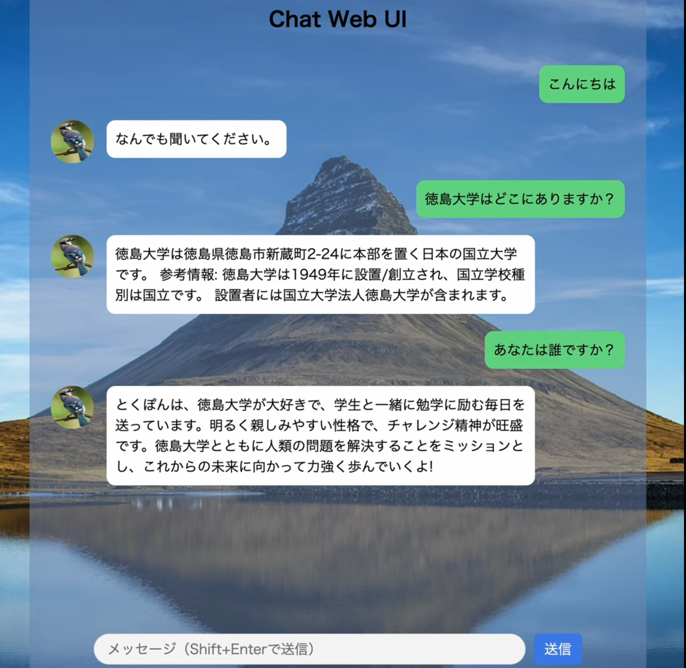

# シンとくぽんTalk
- M1後期輪講で作成したプログラム
- LangChainを使った[とくぽんtalk](https://taiwa.honbu.tokushima-u.ac.jp/taiwa/ui/)の簡易実装
- シンは「新しい」という意味と、「薄い・簡易（Thin）」という意味をかけています

## 処理の流れ
1. WikipediaとYouTubeから徳島大学に関するテキストデータをスクレイピング
2. 上記のデータをベクトルDBに格納し、LangChainを使ってRAGを実装
3. ngrokを使ってREST API化し、Google Colabから外部公開
4. chat ui側に上記で発行されたURLを設定し、GUIからチャットを送信

## 実行方法
1. `tokupon_server.ipynb`をGoogle Colab上で実行する
   1. 途中でngrokのトークンの発行が必要
2. 上記で発行されたURLを`chat_ui/src/index.js`の`API_HOME`に設定する
3. ブラウザで`chat_ui/index.html`を開く

